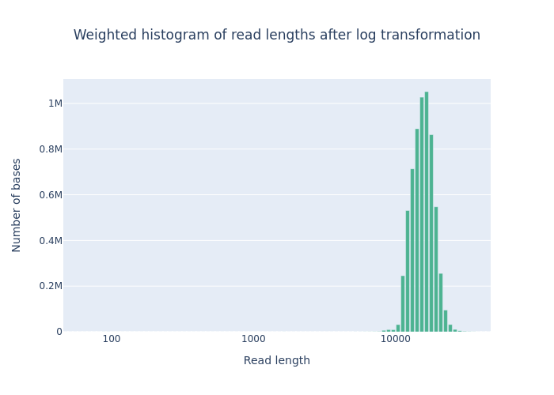

# Introduction

This tutorial guides you through the essential steps of preparing and quality checking genomic sequencing data for genome assembly. We'll be working with both Illumina short reads and PacBio HiFi long reads from *Arabidopsis thaliana* chromosome 2. The workflow includes:

1. Setting up the computational environment
2. Quality control of Illumina reads using FastQC
3. Quality assessment of PacBio HiFi reads using NanoPlot
4. Genome size estimation using GenomeScope

## Environment Setup

First, we'll create a conda environment with all the necessary tools that are not found on the server:

- NanoPlot
- Merqury
- hifiasm
- gffread

```bash
# Creates a new conda environment with required tools
# Takes about 7 minutes to complete
conda env create -f genome_assembly_env.yml

# Verify the environment was created successfully
conda info --envs

# Activate the environment to use the installed tools
conda activate genome_assembly

# Verify that all required tools are installed
conda list | egrep "nanoplot|merqury|hifiasm|gffread"
```

## Data Organization

Our analysis uses the following directory structure:
- `01_Data`: Contains raw sequencing data (Illumina and PacBio HiFi reads)
- `02_References`: Contains reference genome files
- `03_IlluminaQC`: Will store FastQC results
- `04_NanoPlotQC`: Will store NanoPlot results
- `05_GenomeScope`: Will store genome size estimation results

## Quality Control Analysis

### 1. Illumina Data QC using FastQC

FastQC performs quality control checks on Illumina sequencing data. It generates reports with various quality metrics:

```bash
module load fastqc
mkdir 03_IlluminaQC
time fastqc -o 03_IlluminaQC -t 2 01_Data/AT_Illumina_paired_*fastq
```

Key FastQC outputs and their interpretation:

#### Per base sequence quality


#### Per base sequence content


#### Overrepresented sequences


#### Adapter content


### 2. PacBio HiFi Read Analysis using NanoPlot

NanoPlot is specifically designed for long-read sequencing data analysis. It provides detailed statistics and visualizations:

```bash
conda activate genome_assembly
mkdir 04_NanoPlotQC
NanoPlot --fastq 01_Data/AT_HiFi_chr2.fastq.gz -o 04_NanoPlotQC --threads 20
```

<pre>
real    1m31.985s
</pre>

The analysis completed in approximately 1 minute and 31 seconds. The plots above show:

[View Report](assets/images/04_NanoPlotQC/NanoStats.txt)
- Length vs Quality plots: Demonstrate the relationship between read length and quality scores
- Read length distributions: Show the distribution of read lengths in both normal and log scales
- Yield by Length: Indicates cumulative data yield across different read lengths





### 3. Genome Size Estimation using GenomeScope

GenomeScope uses k-mer frequency distributions to estimate genome characteristics. We first generate k-mer counts using Jellyfish:

```bash
mkdir 05_GenomeScope
module load jellyfish
time jellyfish count -m 21 -s 100M -t 20 \
  -C 01_Data/AT_Illumina_paired_*fastq -o 05_GenomeScope/reads.jf
```

Parameters explained:
- `-m 21`: Uses 21-mers (subsequences of length 21)
- `-s 100M`: Allocates hash table size for 100 million reads
- `-t 20`: Utilizes 20 threads for parallel processing
- `-C`: Counts k-mers in both forward and reverse complement

Generate the k-mer frequency histogram:

```bash
time jellyfish histo \
  -t 8 05_GenomeScope/reads.jf > 05_GenomeScope/reads.histo
```

The resulting `reads.histo` file can be uploaded to [GenomeScope](http://genomescope.org/) for analysis.

### Interpretation of the images:


_Common Elements in Both Figures_

- Genome Size (len): Estimated genome size is 21,873,679 bp (12.53 Mb).
- Unique Sequence (uniq): 82.8% of the genome is unique sequence.
- Heterozygosity (het): The heterozygosity rate is 0.0829%, indicating a very low level of heterozygosity.
- Coverage (kcov): Average k-mer coverage is 29.6.
- Error Rate (err): Estimated sequencing error rate is 0.38%.
- Duplication (dup): 1.51% of the genome is duplicated.
- k-mer size (k): k-mer length used for the analysis is 21.

_Key Elements in the Plots_

- X-Axis (Coverage): Represents the k-mer coverage. In the linear plot, it is shown on a linear scale, whereas in the logarithmic plot, it is shown on a logarithmic scale.
- Y-Axis (Frequency): Represents the frequency of k-mers at different coverage levels.
- Blue Bars (observed): Histogram of observed k-mer frequencies.
- Black Line (full model): Model fit to the observed k-mer frequencies.
- Yellow Line (unique sequence): Contribution of unique sequences to the k-mer frequencies.
- Orange Line (errors): Contribution of sequencing errors to the k-mer frequencies.
- Dashed Lines (kmer-peaks): Peaks corresponding to k-mer coverage of unique and repetitive sequences.
- Red Dashed Line (cov-threshold): A threshold to distinguish high-coverage k-mers, typically used to identify potential contaminant sequences or highly repetitive regions. This is set at a very high coverage level (around 1000).
