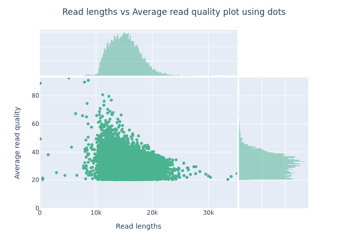
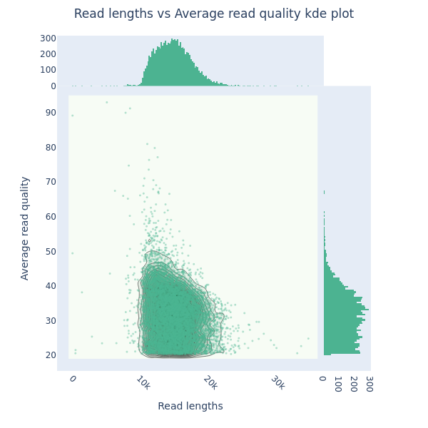
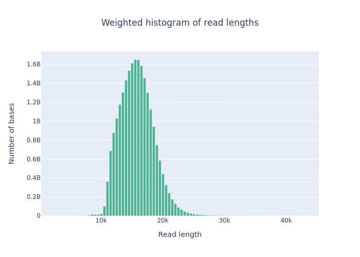
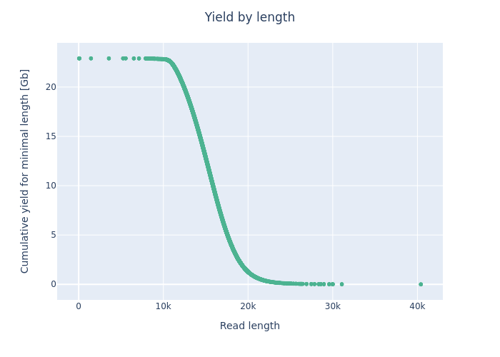

## Data QC - Illumina and PacBio HiFi reads

### Illumina - `FastQC`

```bash
module load fastqc
mkdir 01_FastqcOutput
time fastqc -o 01_FastqcOutput -t 2 04_Chr2Fastq/AT_Illumina_paired_*fastq
```

#### Per base sequence quality


#### Per base sequence content


#### Overrepresented sequences


#### Adapter content


## PacBio HiFi - `nanoplot`
```bash
conda activate genome_assembly
mkdir 03_QC_Nanoplot
NanoPlot --fastq data_to_share/AT_Hifi_1.fastq.gz -o 03_QC_Nanoplot --threads 20
````

It has taken `NanoPlot` about 35 minutes to run for the full data set.

[View Report](assets/images/03_QC_Nanoplot/NanoStats.txt)











## Predicting the genome size with Illumina reads with GenomeScope

```bash
mkdir 02_GenomeScope
module load jellyfish
time jellyfish count -m 21 -s 100M -t 20 \
  -C 04_Chr2Fastq/AT_Illumina_paired_*fastq -o 02_GenomeScope/reads.jf
```

- `-m 21`: 21-mers
- `-s 10M`: 10 million reads # this is the number of reads used to estimate the size of the genome
- `-t 20`: 20 threads

Takes about 18 seconds to run.

```bash
time jellyfish histo \
  -t 8 02_GenomeScope/reads.jf > 02_GenomeScope/reads.histo
```

- `jellyfish histo` is used to estimate the size of the genome using the `reads.jf` file. It outputs the size of the genome in the `reads.histo` file.

Takes about 5 seconds to run.

We can now copy the `reads.histo` to our local computer and upload it to [GenomeScope](http://genomescope.org/)

### Interpretation of the images:


_Common Elements in Both Figures_

- Genome Size (len): Estimated genome size is 21,873,679 bp (12.53 Mb).
- Unique Sequence (uniq): 82.8% of the genome is unique sequence.
- Heterozygosity (het): The heterozygosity rate is 0.0829%, indicating a very low level of heterozygosity.
- Coverage (kcov): Average k-mer coverage is 29.6.
- Error Rate (err): Estimated sequencing error rate is 0.38%.
- Duplication (dup): 1.51% of the genome is duplicated.
- k-mer size (k): k-mer length used for the analysis is 21.

_Key Elements in the Plots_

- X-Axis (Coverage): Represents the k-mer coverage. In the linear plot, it is shown on a linear scale, whereas in the logarithmic plot, it is shown on a logarithmic scale.
- Y-Axis (Frequency): Represents the frequency of k-mers at different coverage levels.
- Blue Bars (observed): Histogram of observed k-mer frequencies.
- Black Line (full model): Model fit to the observed k-mer frequencies.
- Yellow Line (unique sequence): Contribution of unique sequences to the k-mer frequencies.
- Orange Line (errors): Contribution of sequencing errors to the k-mer frequencies.
- Dashed Lines (kmer-peaks): Peaks corresponding to k-mer coverage of unique and repetitive sequences.
- Red Dashed Line (cov-threshold): A threshold to distinguish high-coverage k-mers, typically used to identify potential contaminant sequences or highly repetitive regions. This is set at a very high coverage level (around 1000).

