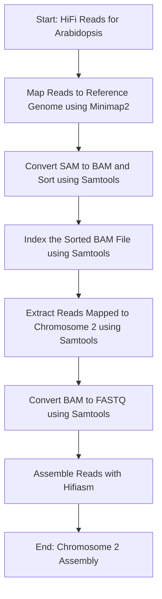

This testing is on Ceres.

Date: `October 10, 2024`  
workdir: `/project/isu_gif_vrsc/satheesh/07_AIUserForum_GenomeAssembly_Workshop_Nov2024`

## Feedback from first genome assembly workshop

1.	More explanation of what the commands are doing, and why each program was chosen.
2.	More explanation of why each step is done, what is accomplished in each step, slowing down the teaching and explaining what is going on at each step in the pipeline. More background information on how the genome assembly steps were developed.


## Data

Hifi only assembly:

```bash
mkdir 01_Data && cd 01_Data
ln -s ../../03_20240426_GenomeAssemblyWorkshop/2024_GenomeAssemblyWorkshop_Athaliana/data_to_share/AT_Hifi.fastq.gz
cd ..
```

```bash
module load hifiasm

hifiasm -o AT.asm -t 36 01_Data/AT_Hifi.fastq.gz

awk '/^S/ { print ">"$2; print $3 }' AT.asm.bp.p_ctg.gfa > AT.asm.bp.p_ctg.fa
```
The assembly has taken ~8 hours to run.

## Assembling chromosome 2 of *A. thaliana*

### Extracting the reads for chromosome 2 of *A. thaliana*



```bash
mkdir 02_Reference && cd 02_Reference
wget ftp://ftp.ensemblgenomes.ebi.ac.uk/pub/plants/release-59/fasta/arabidopsis_thaliana/dna/Arabidopsis_thaliana.TAIR10.dna.toplevel.fa.gz

wget ftp://ftp.ensemblgenomes.ebi.ac.uk/pub/plants/release-59/gff3/arabidopsis_thaliana/Arabidopsis_thaliana.TAIR10.59.gff3.gz

wget ftp://ftp.ensemblgenomes.ebi.ac.uk/pub/plants/release-59/gff3/arabidopsis_thaliana/Arabidopsis_thaliana.TAIR10.59.chromosome.2.gff3.gz

wget ftp://ftp.ensemblgenomes.ebi.ac.uk/pub/plants/release-59/fasta/arabidopsis_thaliana/dna/Arabidopsis_thaliana.TAIR10.dna.chromosome.2.fa.gz

cd ..
```

The whole genome and the corresponding gff3 files were downloaded from [Ensembl](https://plants.ensembl.org/Arabidopsis_thaliana/Info/Index). The chromosome 2 genomic and gff3 files were downloaded from Ensembl as well.

## Step 1. Map reads to chromosome 2 of *A. thaliana*

We are going to use `minimap2` to map the HiFi reads to the reference genome. `minimap2` is a versatile and fast sequence aligner that is widely used for mapping long reads, such as PacBio and Oxford Nanopore reads, to reference genomes. It provides several alignment presets optimized for different sequencing technologies and data types, ensuring accurate and efficient mapping results.

```bash
module load minimap2

mkdir 03_MinimapAlignment

time minimap2 -ax map-hifi -t 20 02_Reference/Arabidopsis_thaliana.TAIR10.dna.toplevel.fa.gz 01_Data/AT_Hifi.fastq.gz > 03_MinimapAlignment/mapped_reads.sam
```

Here, the `-ax` switch specifies the alignment preset, which determines how the reads will be mapped to the reference. For example:  
`-ax map-pb`: Optimized for PacBio continuous long reads (CLR).  
`-ax map-hifi`: Optimized for PacBio HiFi reads.  
`-t 20`: Use 20 threads.

Takes about 47 minutes to run.
<pre>47m26.619s</pre>

The output file `03_MinimapAlignment/mapped_reads.sam` contains the mapped reads in SAM format. 

## Step 2. Convert SAM to BAM and Sort using Samtools

Samtools is primarily used for processing alignment files (such as SAM and BAM) produced by aligners like `minimap2` or `bwa`. It is commonly used to convert between file formats, sort, index, and filter alignment files,

### SAM to BAM Conversion

The SAM format is a human-readable text file that contains sequence alignment information. However, it is often more practical to work with BAM files, which are the binary equivalents of SAM files. BAM files are more efficient in terms of storage and processing speed. Converting SAM to BAM helps to reduce file size and allows for faster downstream processing steps, such as sorting and indexing.

```bash
module load samtools

samtools view -bS 03_MinimapAlignment/mapped_reads.sam > 03_MinimapAlignment/mapped_reads.bam

samtools sort 03_MinimapAlignment/mapped_reads.bam > 03_MinimapAlignment/mapped_reads.sorted.bam
```