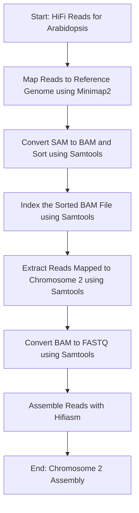
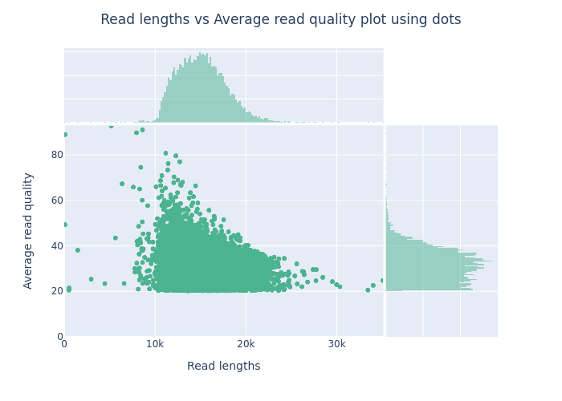
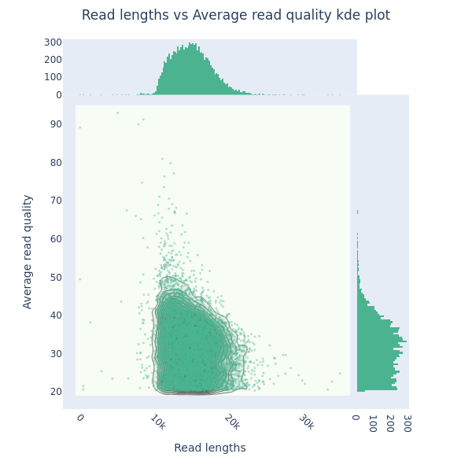
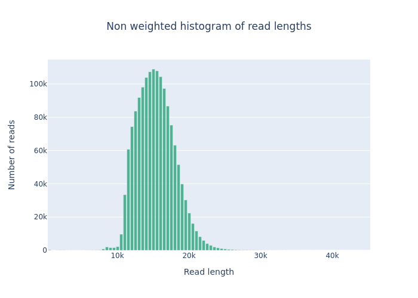
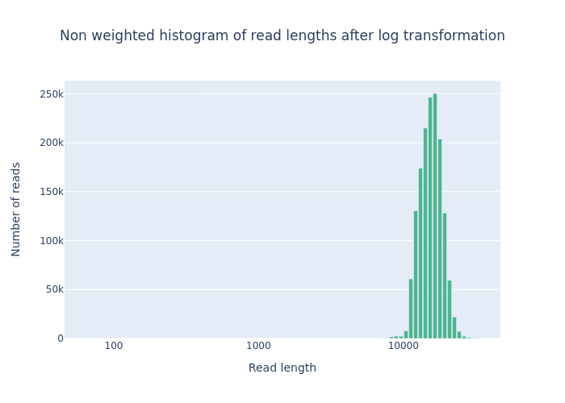
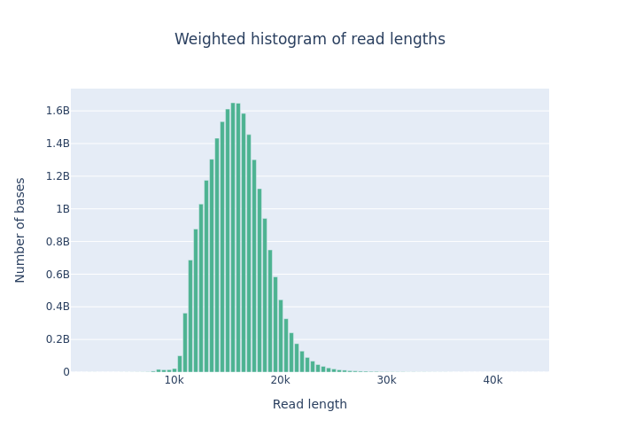
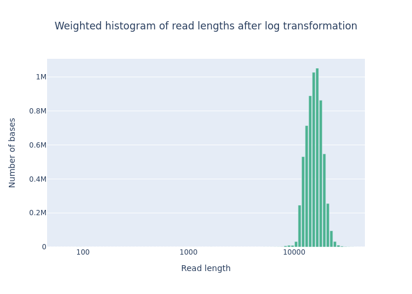
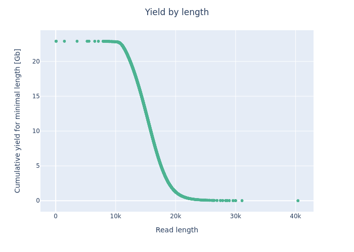

This testing is on Ceres.

Date: `October 10, 2024`  
workdir: `/project/isu_gif_vrsc/satheesh/07_AIUserForum_GenomeAssembly_Workshop_Nov2024`

## Feedback from first genome assembly workshop

1. More explanation of what the commands are doing, and why each program was chosen.
2. More explanation of why each step is done, what is accomplished in each step, slowing down the teaching and explaining what is going on at each step in the pipeline. More background information on how the genome assembly steps were developed.

## Data

Hifi only assembly:

```bash
mkdir 01_Data && cd 01_Data
ln -s ../../03_20240426_GenomeAssemblyWorkshop/2024_GenomeAssemblyWorkshop_Athaliana/data_to_share/AT_Hifi.fastq.gz
cd ..
```

```bash
module load hifiasm

hifiasm -o AT.asm -t 36 01_Data/AT_Hifi.fastq.gz

awk '/^S/ { print ">"$2; print $3 }' AT.asm.bp.p_ctg.gfa > AT.asm.bp.p_ctg.fa
```

The assembly has taken ~8 hours to run.

## Assembling chromosome 2 of _A. thaliana_

### Extracting the reads for chromosome 2 of _A. thaliana_



```bash
mkdir 02_Reference && cd 02_Reference
wget ftp://ftp.ensemblgenomes.ebi.ac.uk/pub/plants/release-59/fasta/arabidopsis_thaliana/dna/Arabidopsis_thaliana.TAIR10.dna.toplevel.fa.gz

wget ftp://ftp.ensemblgenomes.ebi.ac.uk/pub/plants/release-59/gff3/arabidopsis_thaliana/Arabidopsis_thaliana.TAIR10.59.gff3.gz

wget ftp://ftp.ensemblgenomes.ebi.ac.uk/pub/plants/release-59/gff3/arabidopsis_thaliana/Arabidopsis_thaliana.TAIR10.59.chromosome.2.gff3.gz

wget ftp://ftp.ensemblgenomes.ebi.ac.uk/pub/plants/release-59/fasta/arabidopsis_thaliana/dna/Arabidopsis_thaliana.TAIR10.dna.chromosome.2.fa.gz

cd ..
```

The whole genome and the corresponding gff3 files were downloaded from [Ensembl](https://plants.ensembl.org/Arabidopsis_thaliana/Info/Index). The chromosome 2 genomic and gff3 files were downloaded from Ensembl as well.

## Step 1. Map reads to chromosome 2 of _A. thaliana_

We are going to use `minimap2` to map the HiFi reads to the reference genome. `minimap2` is a versatile and fast sequence aligner that is widely used for mapping long reads, such as PacBio and Oxford Nanopore reads, to reference genomes. It provides several alignment presets optimized for different sequencing technologies and data types, ensuring accurate and efficient mapping results.

```bash
module load minimap2

mkdir 03_MinimapAlignment

time minimap2 -ax map-hifi -t 20 02_Reference/Arabidopsis_thaliana.TAIR10.dna.toplevel.fa.gz 01_Data/AT_Hifi.fastq.gz > 03_MinimapAlignment/mapped_reads.sam
```

Here, the `-ax` switch specifies the alignment preset, which determines how the reads will be mapped to the reference. For example:  
`-ax map-pb`: Optimized for PacBio continuous long reads (CLR).  
`-ax map-hifi`: Optimized for PacBio HiFi reads.  
`-t 20`: Use 20 threads.

Takes about 47 minutes to run.

<pre>47m26.619s</pre>

The output file `03_MinimapAlignment/mapped_reads.sam` contains the mapped reads in SAM format.

## Step 2. Convert SAM to BAM and Sort using Samtools

Samtools is primarily used for processing alignment files (such as SAM and BAM) produced by aligners like `minimap2` or `bwa`. It is commonly used to convert between file formats, sort, index, and filter alignment files,

### SAM to BAM Conversion

The SAM format is a human-readable text file that contains sequence alignment information. However, it is often more practical to work with BAM files, which are the binary equivalents of SAM files. BAM files are more efficient in terms of storage and processing speed. Converting SAM to BAM helps to reduce file size and allows for faster downstream processing steps, such as sorting and indexing.

```bash
module load samtools
```

#### `samtools view`

`samtools view` is used to convert between file formats, such as from SAM to BAM. It can also be used to filter alignments based on specific criteria, such as mapping quality or read flags. The `-bS` options indicate that the output should be in BAM format (`-b`) and that the input is in SAM format (`-S`).

```bash
time samtools view -bS 03_MinimapAlignment/mapped_reads.sam > 03_MinimapAlignment/mapped_reads.bam
```

<pre>
34m8.442s
</pre>

`samtools view` takes about 34 minutes to run.

### Sorting

`samtools sort` is used to sort alignments in a BAM file. It sorts the alignments based on the coordinate of the read. The output is a new sorted file in the output directory.

```bash
time samtools sort -@ 20 -o 03_MinimapAlignment/mapped_reads.sorted.bam 03_MinimapAlignment/mapped_reads.bam
```

<pre>
3m47.967s
</pre>

`samtools sort` takes about 4 minutes to run.

## Step 3. Index the Sorted BAM File using Samtools

Indexing a BAM file is crucial for efficient data retrieval, especially for large alignment files. The index allows for quick access to specific regions of the BAM file without scanning through the entire file. This is particularly useful for downstream analysis steps such as variant calling, visualization, and extracting specific genomic regions.

```bash
samtools index 03_MinimapAlignment/mapped_reads.sorted.bam
```

## Step 4. Extract Reads Mapped to Chromosome 2 using Samtools

```bash
time samtools view -b 03_MinimapAlignment/mapped_reads.sorted.bam 2 > 03_MinimapAlignment/mapped_reads.chr2.bam
```

In this step, `samtools view` is used to extract only the reads that are mapped to chromosome 2 from the sorted BAM file. The `-b` flag specifies that the output should be in BAM format. The value `2` indicates chromosome 2, which allows you to filter and extract reads specifically mapped to this chromosome. The output is saved as a new BAM file (`mapped_reads.chr2.bam`), containing only the reads that align to chromosome 2.

<pre>
5m46.610s
</pre>

The time taken for this step is about 6 minutes.

## Step 5. Convert BAM to FASTQ using Samtools

```bash
mkdir 04_Chr2Fastq
time samtools fastq -@ 20 03_MinimapAlignment/mapped_reads.chr2.bam > 04_Chr2Fastq/mapped_reads.chr2.fastq
```

<pre>
0m22.208s
</pre>

The time taken for this step is about 22 seconds.

## Step 6. Assemble Reads with Hifiasm

```bash
module load hifiasm

time hifiasm -o chr2.asm -t 20 -m 10 04_Chr2Fastq/mapped_reads.chr2.fastq
```
<pre>
156m45.936s
</pre>

The time taken for this step is about 156 minutes.

## Converting GFA to fa

```bash
awk '/^S/ { print ">"$2; print $3 }' chr2.asm.bp.p_ctg.gfa > chr2.asm.bp.p_ctg.fa
```

The output file `chr2.asm.bp.p_ctg.fa` contains the assembled reads in FASTA format.

```bash
ml bbtools
stats.sh chr2.asm.bp.p_ctg.fa
```
**Assembly statistics**
<pre>
A	C	G	T	N	IUPAC	Other	GC	GC_stdev
0.3189	0.1806	0.1859	0.3146	0.0000	0.0000	0.0000	0.3665	0.0206

Main genome scaffold total:         	48
Main genome contig total:           	48
Main genome scaffold sequence total:	29.730 MB
Main genome contig sequence total:  	29.730 MB  	0.000% gap
Main genome scaffold N/L50:         	3/4.99 MB
Main genome contig N/L50:           	3/4.99 MB
Main genome scaffold N/L90:         	14/328.962 KB
Main genome contig N/L90:           	14/328.962 KB
Max scaffold length:                	6.01 MB
Max contig length:                  	6.01 MB
Number of scaffolds > 50 KB:        	35
% main genome in scaffolds > 50 KB: 	98.61%
</pre>

`stats.sh` gives the statistics of the assembled reads. It is part of the BBTools package. 

## Step 7. Reducing data set to 50X using `Filtlong`

```bash
time /project/isu_gif_vrsc/satheesh/programs/Filtlong/bin/filtlong --min_length 1000 --keep_percent 90 --target_bases 200000000 04_Chr2Fastq/mapped_reads.chr2.fastq | gzip > 04_Chr2Fastq/mapped_reads.chr2.filtlong.fastq.gz
```

Step 7 took about 2 minutes to run.

<details>
<summary>Terminal output</summary>
<pre>
Scoring long reads
  267718 reads (4071902309 bp)

Filtering long reads
  target: 100000000 bp
  keeping 100012551 bp

Outputting passed long reads

real	1m55.500s
</pre>
</details>

What you see below is from the `filtlong` documentation explaining the parameters.

* `--min_length 1000` ← Discard any read which is shorter than 1 kbp.
* `--keep_percent 90` ← Throw out the worst 10% of reads. This is measured by bp, not by read count. So this option throws out the worst 10% of read bases.
* `--target_bases 500000000` ← Remove the worst reads until only 500 Mbp remain, useful for very large read sets. If the input read set is less than 500 Mbp, this setting will have no effect.
* `04_Chr2Fastq/mapped_reads.chr2.fastq` ← The path to input long reads to be filtered (must be FASTQ format). 
* `| gzip > 04_Chr2Fastq/mapped_reads.chr2.filtlong.fastq.gz` ← Filtlong outputs the filtered reads to stdout. Pipe to gzip to keep the file size down.

<pre>
tree 04_Chr2Fastq/
04_Chr2Fastq/
├── mapped_reads.chr2.fastq
└── mapped_reads.chr2.filtlong.fastq.gz
</pre>

## Step 8. Run `hifiasm` on the filtered reads

```bash
module load hifiasm
mkdir 05_FilteredReadsAssembly

time hifiasm -o 05_FilteredReadsAssembly/chr2.filtlong.asm -t 20 -m 10 04_Chr2Fastq/mapped_reads.chr2.filtlong.fastq.gz
```
The above command was run in a slurm job. 

**Getting the time elapsed**

```bash
sacct -j 13368668 --format=JobID,JobName,Elapsed
```

<pre>
JobID           JobName    Elapsed
------------ ---------- ----------
13368668           hifi   00:01:48
13368668.ba+      batch   00:01:48
13368668.ex+     extern   00:01:48
</pre>

This assembly took about 1 minute and 48 seconds to run.

**Convert `gfa` to `fasta` format**

```bash
awk '/^S/{print ">"$2;print $3}' 05_FilteredReadsAssembly/chr2.filtlong.asm.bp.p_ctg.gfa > 05_FilteredReadsAssembly/chr2.filtlong.asm.bp.p_ctg.fa # get primary contigs in FASTA
```
---

time /project/isu_gif_vrsc/satheesh/programs/Filtlong/bin/filtlong --min_length 1000 --keep_percent 90 --target_bases 1000000000 04_Chr2Fastq/mapped_reads.chr2.fastq | gzip > 04_Chr2Fastq/mapped_reads.chr2.filtlong.fastq.gz

<pre>
Scoring long reads
  267718 reads (4071902309 bp)

Filtering long reads
  target: 1000000000 bp
  keeping 1000014188 bp

Outputting passed long reads


real	4m33.734s
user	4m28.819s
sys	0m8.363s
</pre>

Running the assembly with this filtered set of reads.

Using 52x coverage, the assembly happens in 14 minutes. 

awk '/^S/{print ">"$2;print $3}' 05_FilteredReadsAssembly/chr2.filtlong_p2000.asm.bp.p_ctg.gfa > 05_FilteredReadsAssembly/chr2.filtlong_p2000.asm.bp.p_ctg.fa


This part of the work is done on nova. The workdir is `/work/gif3/satheesh/2024_GenomeAssemblyWorkshop/08_Arabidopsis_HiFi_HiC_Illumina`.

## Step 9. Extracting HiC and Illumina reads mapping to chromosome 2

```bash
python extract_reads_from_region.py
```

<pre>
usage: extract_reads_from_region.py [-h] -i INDEX -r READS [READS ...] [-o OUTPUT] [-t THREADS] -g REGION [-d OUTDIR]
</pre>

```bash
mkdir 01_Reference

# copy the reference genome to the 01_Reference directory
cp ../../2024_Gauntlet/02_TestSet/Arabidopsis_thaliana.TAIR10.dna.toplevel.fa 01_Reference/

# activate the conda environment
conda activate genome_assembly # access to bwa-mem2 and samtools

# Index the reference genome
bwa-mem2 index 01_Reference/Arabidopsis_thaliana.TAIR10.dna.toplevel.fa

# extract reads from the reference genome that map to chromosome 2
time python extract_reads_from_region.py -i 01_Reference/Arabidopsis_thaliana.TAIR10.dna.toplevel.fa -r data_to_share/AT_Illumina_1.fastq.gz data_to_share/AT_Illumina_2.fastq.gz -o illumina_reads -t `nproc` -g 2 -d Illumina
```
Did not get a good alignment output. Write script to extract reads from the reference genome that map to chromosome 2.

```bash
bwa-mem2 mem -t 20 01_Reference/Arabidopsis_thaliana.TAIR10.dna.toplevel.fa data_to_share/AT_Illumina_1.fastq.gz data_to_share/AT_Illumina_2.fastq.gz | samtools sort -@ 20 -o AT_Illumina_aligned.bam

samtools index Illumina/AT_Illumina_aligned.bam

samtools view -b Illumina/AT_Illumina_aligned.bam 2 > Illumina/AT_Illumina_aligned_chr2.bam

samtools index Illumina/AT_Illumina_aligned_chr2.bam

time samtools fastq -1 Illumina/AT_Illumina_aligned_chr2_1.fastq -2 Illumina/AT_Illumina_aligned_chr2_2.fastq -n Illumina/AT_Illumina_aligned_chr2.bam

tree Illumina
```

<pre>
Illumina/
├── AT_Illumina_aligned.bam
├── AT_Illumina_aligned.bam.bai
├── AT_Illumina_aligned_chr2_1.fastq.gz
├── AT_Illumina_aligned_chr2_2.fastq.gz
├── AT_Illumina_aligned_chr2.bam
└── AT_Illumina_aligned_chr2.bam.bai

0 directories, 6 files
</pre>


## Predicting the genome size with Illumina reads

```bash
mkdir 02_GenomeScope

conda activate genome_assembly

unpigz Illumina/AT_Illumina_aligned_chr2*fastq.gz

time jellyfish count -m 21 -s 100M -t 8 \
  -C Illumina/AT_Illumina_aligned_chr2*fastq -o 02_GenomeScope/reads_clean.jf
```

- `-m 21`: 21-mers
- `-s 10M`: 10 million reads # this is the number of reads used to estimate the size of the genome
- `-t 8`: 8 threads

Takes about 48 seconds to run.

```bash
time jellyfish histo \
  -t 8 02_GenomeScope/reads_clean.jf > 02_GenomeScope/reads_clean.histo
```
- `jellyfish histo` is used to estimate the size of the genome using the `reads_clean.jf` file. It outputs the size of the genome in the `reads_clean.histo` file.

We can now copy the `reads_clean_s288c.histo` to our local computer and upload it to [GenomeScope](http://genomescope.org/)

### Interpretation of the images:

*Common Elements in Both Figures*

- Genome Size (len): Estimated genome size is 12,535,070 bp (12.53 Mb).
- Unique Sequence (uniq): 88.5% of the genome is unique sequence.
- Heterozygosity (het): The heterozygosity rate is 0.0436%, indicating a very low level of heterozygosity.
- Coverage (kcov): Average k-mer coverage is 20.4.
- Error Rate (err): Estimated sequencing error rate is 0.0238%.
- Duplication (dup): 0.86% of the genome is duplicated.
- k-mer size (k): k-mer length used for the analysis is 21.

*Key Elements in the Plots*

- X-Axis (Coverage): Represents the k-mer coverage. In the linear plot, it is shown on a linear scale, whereas in the logarithmic plot, it is shown on a logarithmic scale.
- Y-Axis (Frequency): Represents the frequency of k-mers at different coverage levels.
- Blue Bars (observed): Histogram of observed k-mer frequencies.
- Black Line (full model): Model fit to the observed k-mer frequencies.
- Yellow Line (unique sequence): Contribution of unique sequences to the k-mer frequencies.
- Orange Line (errors): Contribution of sequencing errors to the k-mer frequencies.
- Dashed Lines (kmer-peaks): Peaks corresponding to k-mer coverage of unique and repetitive sequences.
- Red Dashed Line (cov-threshold): A threshold to distinguish high-coverage k-mers, typically used to identify potential contaminant sequences or highly repetitive regions. This is set at a very high coverage level (around 1000).

## GenomeScope for all reads

```bash
time jellyfish count -m 21 -s 100M -t 8 -C data_to_share/AT_Illumina_*fastq -o 02_GenomeScope/all_reads_clean.jf
# real    8m2.388s

time jellyfish histo  -t 8 02_GenomeScope/all_reads_clean.jf > 02_GenomeScope/all_reads_clean.histo
# real    0m38.937s

```

KAT analysis

```bash
kat comp -t 16 -n -o kat_analysis data_to_share/AT_Illumina_1.fastq data_to_share/AT_Illumina_2.fastq


---

## Step 7. Identify rRNA Genes using Barrnap

To identify rRNA genes in the chromosome 2 assembly, you can use Barrnap:

```bash
barrnap --kingdom euk 03_MinimapAlignment/mapped_reads.chr2.fastq > rRNA_annotations.gff
```
Barrnap is used to identify rRNA gene locations, and it outputs the regions as a GFF file.

## Step 8. Mask rRNA Regions using Bedtools

Once the rRNA gene locations are identified, mask those regions using Bedtools to prevent BRAKER3 from predicting genes in these regions.

```bash
bedtools maskfasta -fi 03_MinimapAlignment/mapped_reads.chr2.fastq -bed rRNA_annotations.gff -fo masked_chr2.fasta
```
This creates a masked version of the assembly where rRNA regions are replaced with `N`s.

## Step 9. Run BRAKER3 on Masked Assembly

Run BRAKER3 on the masked assembly to predict genes while avoiding rRNA regions.

```bash
braker.pl --genome=masked_chr2.fasta --bam=RNAseq_mapped_chr2.bam --species=arabidopsis --softmasking
```
This will use the masked assembly for gene prediction, ignoring rRNA regions.

----
Running this on Atlas

workdir:`project/gif_vrsc_workshop/Eukaryotes/satheesh/03_TexasWorkshop`

Using information on this site. https://hackmd.io/@frcastel/Hy8mVrBNp#Test-data
Need to see if there is anything interesting in the scripts.

```bash
apptainer build braker3.sif docker://teambraker/braker3:latest

Downloading three scripts 
apptainer exec -B $PWD:$PWD braker3.sif cp /opt/BRAKER/example/singularity-tests/test1.sh .
apptainer exec -B $PWD:$PWD braker3.sif cp /opt/BRAKER/example/singularity-tests/test2.sh .
apptainer exec -B $PWD:$PWD braker3.sif cp /opt/BRAKER/example/singularity-tests/test3.sh .

module load apptainer

time bash test1.sh


## Data QC - Illumina and PacBio HiFi reads

Illumina - `FastQC`

PacBio HiFi - `nanoplot`
```bash
conda activate genome_assembly
mkdir 03_QC_Nanoplot
NanoPlot --fastq data_to_share/AT_Hifi_1.fastq.gz -o 03_QC_Nanoplot --threads 20
```
This is the full data set. We can show the plots, but not necessary to run it during the workshop.

<pre>
real    35m3.976s
</pre>

It has taken `NanoPlot` about 35 minutes to run for the full data set.

[View Report](assets/images/03_QC_Nanoplot/NanoStats.txt)













