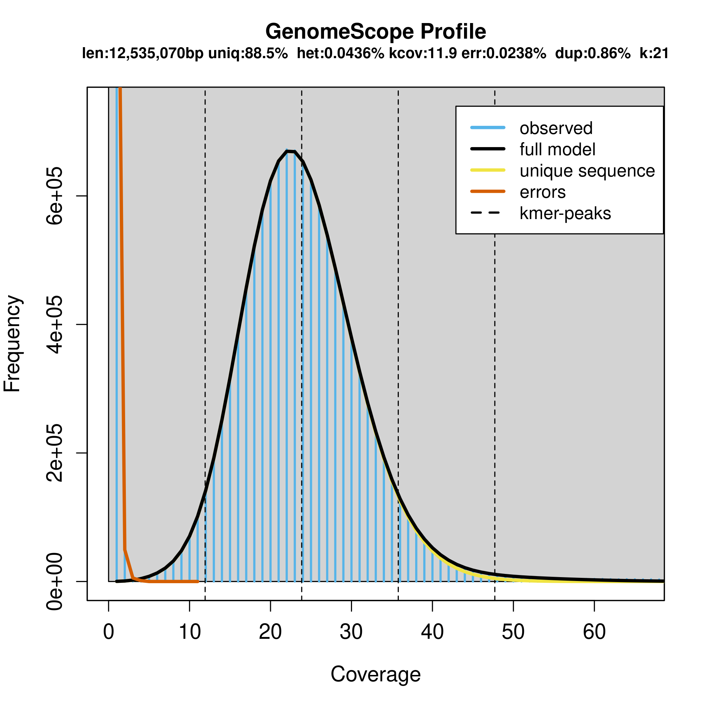
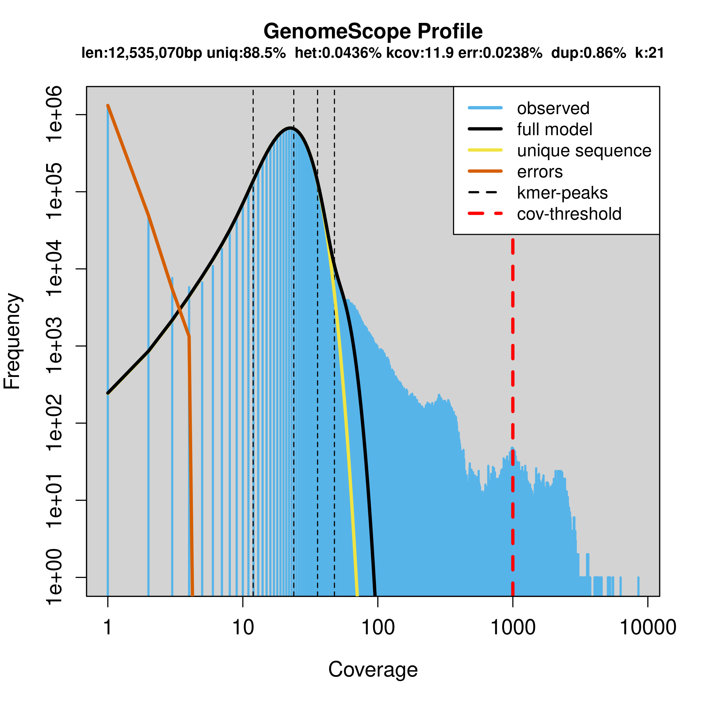

---
output:
  pdf_document: 
    latex_engine: xelatex
  html_document: default
---
## Day2: Eukaryotic Genome Assembly

## Genome assembly of *Saccharomyces cerevisiae* S288C 

[Benchmarking of long-read sequencing, assemblers and polishers for yeast genome ](https://academic.oup.com/bib/article/23/3/bbac146/6576452)

<https://www.ncbi.nlm.nih.gov/sra?linkname=bioproject_sra_all&from_uid=792930>

Nanopore reads: 800X - The subsampled reads are 30X coverage  
Illumina reads: 240X - The subsampled reads are 50X coverage

Yeast genome
Genome size: 12157105  
Number of chromosomes: 16  
Mitochondrion: 1

Navigate to your work directory. And within your work dir, execute the following commands.
In my case, my workdir is: `/project/gif_vrsc_workshop/GenomeAssemblyWorkshop/user2`.

This command would create softlinks to the data in the `Day2` directory up two levels. Please note the `.` at the end.

```bash
mkdir Day2

cd Day2

ln -s ../../Day2/* .
```

Let us take a look at the directory structure of `Day2`:
```bash
tree ../Day2
Day2/
├── 00_RawData
│   ├── nanopore_30X.fastq.gz
│   ├── subsampled_SRR17374239_1.fastq
│   └── subsampled_SRR17374239_2.fastq
└── 01_Reference
    └── GCF_000146045.2_R64_genomic.fna

2 directories, 4 files
```
There are 2 directories and 4 files in all. 

### I. Details of the reference genome:  
Let us create a variable to the software directory, which can then be used as a placeholder to that directory.

```bash
software=/90daydata/shared/GenomeAssemblyWorkshop/software
```
Getting the header lines of the reference fasta file.

```bash
grep ">" 01_Reference/GCF_000146045.2_R64_genomic.fna
>chromosome_I
>chromosome_II
>chromosome_III
>chromosome_IV
>chromosome_V
>chromosome_VI
>chromosome_VII
>chromosome_VIII
>chromosome_IX
>chromosome_X
>chromosome_XI
>chromosome_XII
>chromosome_XIII
>chromosome_XIV
>chromosome_XV
>chromosome_XVI
>mitochondrion
```
Summary statistics with `gfastats`:
```bash
$software/gfastats/build/bin/gfastats 01_Reference/GCF_000146045.2_R64_genomic.fna
+++Assembly summary+++:                                                                                                        [0/1830]
# scaffolds: 17
Total scaffold length: 12157105
Average scaffold length: 715123.82
Scaffold N50: 924431
Scaffold auN: 904609.50
Scaffold L50: 6
Largest scaffold: 1531933
Smallest scaffold: 85779
# contigs: 17
Total contig length: 12157105
Average contig length: 715123.82
Contig N50: 924431
Contig auN: 904609.50
Contig L50: 6
Largest contig: 1531933
Smallest contig: 85779
...
```
The total genome is `12157105` bases long and there are 17 scaffolds.

### II. Long read data cleaning

Quality filtering of long reads using `chopper`.
```bash
mkdir 02_TrimmedData

time zcat 00_RawData/nanopore_30X.fastq.gz | \
  $software/chopper -q 12 -l 1000 \
  --headcrop 50 |pigz > 02_TrimmedData/nanopore_30X_q12.fastq.gz

less 02_TrimmedData/nanopore_30X_q12.fastq.gz |grep "^@SRR" -c
15566
```
We are going to filter the reads further to about 8X coverage using `filtlong`.

```bash
time $software/Filtlong/bin/filtlong --min_length 1000 \
  --keep_percent 90 --target_bases 100000000 02_TrimmedData/nanopore_30X_q12.fastq.gz \
  | gzip > 02_TrimmedData/nanopore_100MB_filtered.fastq.gz

zcat 02_TrimmedData/nanopore_100MB_filtered.fastq.gz |grep "^@SRR" -c
5428
```

### III. Predicting the genome size with Illumina reads

```bash
mkdir 03_GenomeScope

time $software/jellyfish-2.3.1/bin/jellyfish count -m 21 -s 100M -t 2 \
  -C 00_RawData/subsampled_SRR17374239_* -o 03_GenomeScope/reads_clean_s288c.jf

time $software/jellyfish-2.3.1/bin/jellyfish histo \
  -t 10 03_GenomeScope/reads_clean_s288c.jf > 03_GenomeScope/reads_clean_s288c.histo
```
We can now copy the `reads_clean_s288c.histo` to our local computer and upload it to [GenomeScope](http://genomescope.org/)





#### Interpretation of the images:

*Common Elements in Both Figures*

- Genome Size (len): Estimated genome size is 12,535,070 bp (12.53 Mb).
- Unique Sequence (uniq): 88.5% of the genome is unique sequence.
- Heterozygosity (het): The heterozygosity rate is 0.0436%, indicating a very low level of heterozygosity.
- Coverage (kcov): Average k-mer coverage is 20.4.
- Error Rate (err): Estimated sequencing error rate is 0.0238%.
- Duplication (dup): 0.86% of the genome is duplicated.
- k-mer size (k): k-mer length used for the analysis is 21.

*Key Elements in the Plots*

- X-Axis (Coverage): Represents the k-mer coverage. In the linear plot, it is shown on a linear scale, whereas in the logarithmic plot, it is shown on a logarithmic scale.
- Y-Axis (Frequency): Represents the frequency of k-mers at different coverage levels.
- Blue Bars (observed): Histogram of observed k-mer frequencies.
- Black Line (full model): Model fit to the observed k-mer frequencies.
- Yellow Line (unique sequence): Contribution of unique sequences to the k-mer frequencies.
- Orange Line (errors): Contribution of sequencing errors to the k-mer frequencies.
- Dashed Lines (kmer-peaks): Peaks corresponding to k-mer coverage of unique and repetitive sequences.
- Red Dashed Line (cov-threshold): A threshold to distinguish high-coverage k-mers, typically used to identify potential contaminant sequences or highly repetitive regions. This is set at a very high coverage level (around 1000).

### IV. De novo genome assembly with Nanopore reads

We will run genome assembly with `flye`.
```bash
time $software/Flye/bin/flye \
  --nano-raw 02_TrimmedData/nanopore_100MB_filtered.fastq.gz \
  --out-dir 04b_FlyeOut \
  --genome-size 12m \
  --threads 8 \
  -i 4 

```
gfastats:
```bash
$software/gfastats/build/bin/gfastats 04_FlyeOut/assembly.fasta
```

### V. Genome assembly evaluation with k-mers

Determining the optimal k-mer length (k) for analyzing a given set of sequencing reads
```bash
$software/merqury/best_k.sh 12335797
# 16.7603
```
Evaluation with `merqury`.
```bash
time $software/meryl-1.3/bin/meryl \
  k=17 count output s288c_nanopore.meryl 02_TrimmedData/nanopore_100MB_filtered.fastq.gz
# real    0m5.599s

mkdir 05_Merqury_Output_Nanopore
cd 05_Merqury_Output_Nanopore
$software/merqury/merqury.sh ../s288c_nanopore.meryl \
  ../04_FlyeOut/assembly.fasta merqury_out

cat merqury_out.qv
# assembly        132080  12207077        31.94   0.000639731

cat merqury_out.completeness.stats
# assembly        all     8305853 8543157 97.2223
```

### VI. Busco analysis with `compleasm`:

BUSCO (Benchmarking Universal Single-Copy Orthologs) is used to assess the completeness and quality of genome assemblies and annotations by comparing them to a database of conserved single-copy orthologs.

```bash
time $software/compleasm_kit/compleasm.py run -t 10 \
  -l saccharomycetes -L 00_RawData/mb_downloads/saccharomycetes_odb10 \
  -a 04_FlyeOut/assembly.fasta -o 06_Compleasm_Nanopore

# S:96.77%, 2068
# D:1.45%, 31
# F:0.19%, 4
# I:0.00%, 0
# M:1.59%, 34
# N:2137
```

### VII. Polishing:

Polishing the genome with `nextPolish2`. 
```bash
mkdir 07_NextPolish2_Polishing

cd 07_NextPolish2_Polishing/

ln -s ../04_FlyeOut/assembly.fasta

time $software/Winnowmap/bin/meryl count k=15 output merylDB assembly.fasta

time $software/Winnowmap/bin/meryl print \
  greater-than distinct=0.9998 merylDB > repetitive_k15.txt

module load samtools

time $software/Winnowmap/bin/winnowmap -t 10 \
  -W repetitive_k15.txt -ax map-ont assembly.fasta \
  ../02_TrimmedData/nanopore_100MB_filtered.fastq.gz \
  | samtools sort -@ 7 -o nanopore.map.sort.bam -

samtools index nanopore.map.sort.bam

ln -s ../00_RawData/subsampled_SRR17374239_* .

time $software/yak/yak count -o k31.yak -k 31 -b 37 \
  <(cat subsampled_SRR17374239_1.clean.fastq) <(cat subsampled_SRR17374239_2.clean.fastq)

time $software/yak/yak count -o k21.yak -k 21 -b 37 \
  <(cat subsampled_SRR17374239_1.clean.fastq) <(cat subsampled_SRR17374239_2.clean.fastq)

time $software/NextPolish2/target/release/nextPolish2 \
  -t 10 nanopore.map.sort.bam assembly.fasta k21.yak k31.yak > asm.np2.fasta

$software/merqury/merqury.sh ../s288c_nanopore.meryl/ asm.np2.fasta merqury_out
cat merqury_out.qv
# asm.np2 71633   12202402        34.6058 0.000346275
cat merqury_out.completeness.stats
# asm.np2 all     8304047 8543157 97.2012

time $software/compleasm_kit/compleasm.py run -t 10 -l saccharomycetes \
  -L ../00_RawData/mb_downloads/saccharomycetes_odb10 \
  -a asm.np2.fasta -o 01_Compleasm_NanoporePolished

# S:96.91%, 2071
# D:1.45%, 31
# F:0.09%, 2
# I:0.00%, 0
# M:1.54%, 33
# N:2137
cd ..
```
### VIII. Ragtag Scaffolding:

`ragtag.py scaffold` scaffolds a fragmented genome assembly by aligning it to a reference genome, thereby improving the order and orientation of the contigs.
```bash
time ragtag.py scaffold -t 10 \
  -u 01_Reference/GCF_000146045.2_R64_genomic.fna 07_NextPolish2_Polishing/asm.np2.fasta \
  -o 08_Ragtag
```
